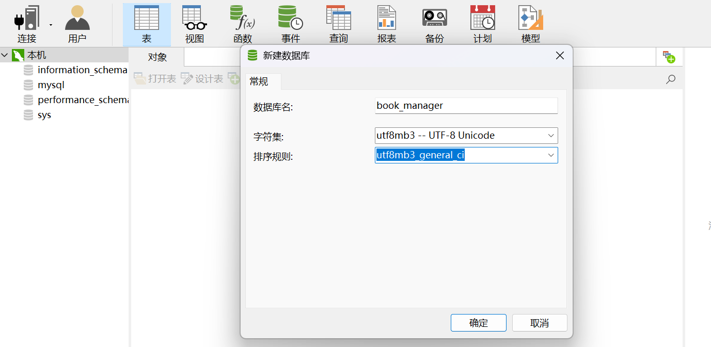

# Personal Book Management System

## Project Overview
This project is a personal book management system based on Node.js + Express + EJS. It supports user registration, login, personal profile management, book collection, book search, and admin backend management.

## Database Initialization & Operations
1. **Database Structure**:
   - The database script is located in the `database_schema.sql` file.
   - It contains three main tables: Users, Books, UserBooks (user book collection table), and an admin flag field.
2. **Execute Database Script**:
   - Use a MySQL client or GUI tool to execute the `database_schema.sql` file:
     ```sql
     source /path/to/database_schema.sql;
     ```
   - Make sure you have created the database and switched to the target database.

## Code Database Configuration Modification
Right-click to create a new database, then right-click again to run the SQL file as shown in the image.


1. **Database Configuration File**:
   - The database connection configuration is in the `db.js` file.
   - Modify the following content to match your database environment:
     ```js
     // ... existing code ...
     const pool = mysql.createPool({
       host: 'localhost', // Database host
       user: 'your_mysql_user', // Database username
       password: 'your_mysql_password', // Database password
       database: 'your_database_name', // Database name
       // ... other configurations ...
     });
     // ... existing code ...
     ```

## Project Startup & Running
1. **Start the Project**:
   - npm start
2. **Access Address**:
   - Default: http://localhost:3000/  

## Main Features Description

### Login

#### User Login

Username: 111@qq.com

Password: 111

#### Admin Login

Username: admin@qq.com

Password: admin

### User Features:
- User registration, login, logout  
  - Related code: `routes/users.js` (register, login, logout APIs), `views/login.ejs`, `views/register.ejs` (frontend pages), `views/profile.ejs` (profile page)
- View and edit personal profile (username, avatar, password)  
  - Related code: `routes/users.js` (profile get & update APIs), `views/profile.ejs` (profile edit page)
- Book search (by title, author, supports sorting)  
  - Related code: `routes/users.js` (search APIs), `views/dashboard.ejs` (search & display page)
- Collect books, add tags, notes, ratings, reading status  
  - Related code: `routes/users.js` (collection, tags, notes, ratings, status APIs), `views/dashboard.ejs` (collection & operation UI)
- View and manage personal collection  
  - Related code: `routes/users.js` (get personal collection API), `views/dashboard.ejs` (collection display)
### Admin Features:
- Admin login, logout  
  - Related code: `routes/admin.js` (admin login, logout APIs), `views/admin_login.ejs` (login page)
- User management (view, edit, delete users, set admin permissions)  
  - Related code: `routes/admin.js` (user management APIs), `views/admin_users.ejs` (user management page), `views/admin_edit_user.ejs` (edit user page)